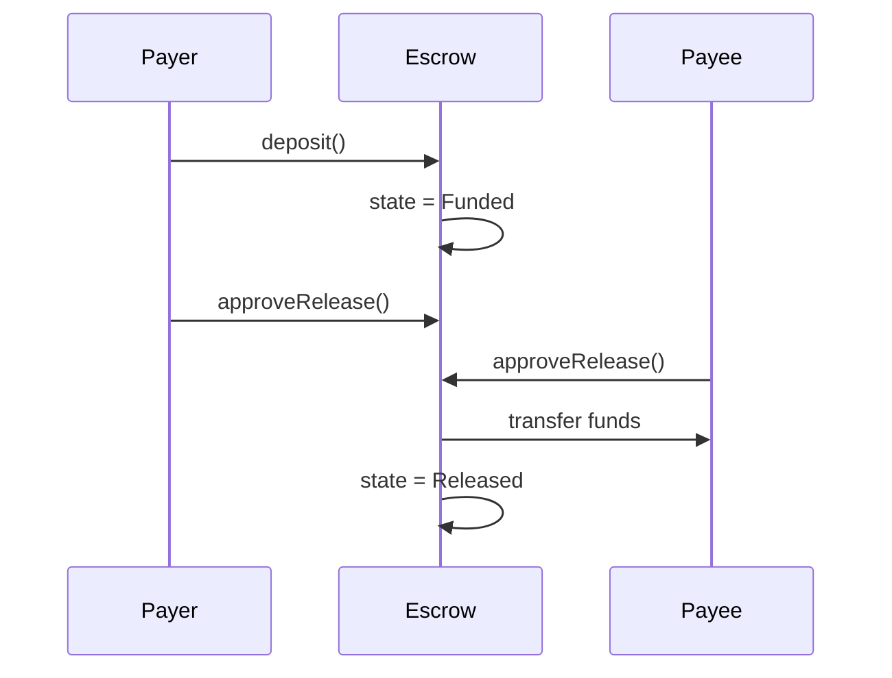

# Sequence Flows

```mermaid
sequenceDiagram
    participant Payer
    participant Escrow
    participant Payee

    Payer->>Escrow: deposit()
    Escrow->>Escrow: state = Funded
    Payer->>Escrow: approveRelease()
    Payee->>Escrow: approveRelease()
    Escrow->>Payee: transfer funds
    Escrow->>Escrow: state = Released
```
